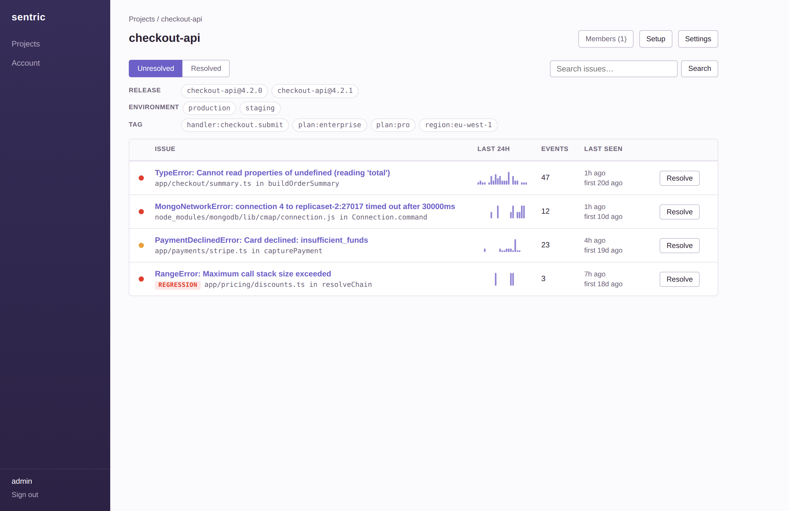
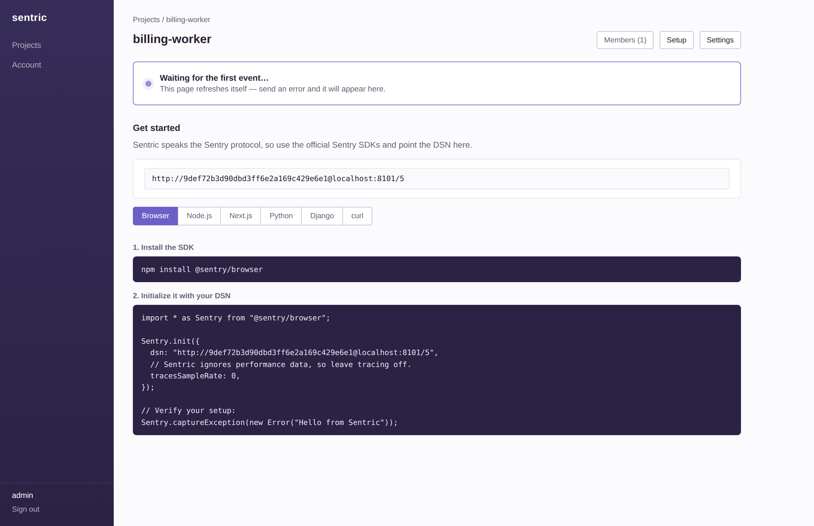
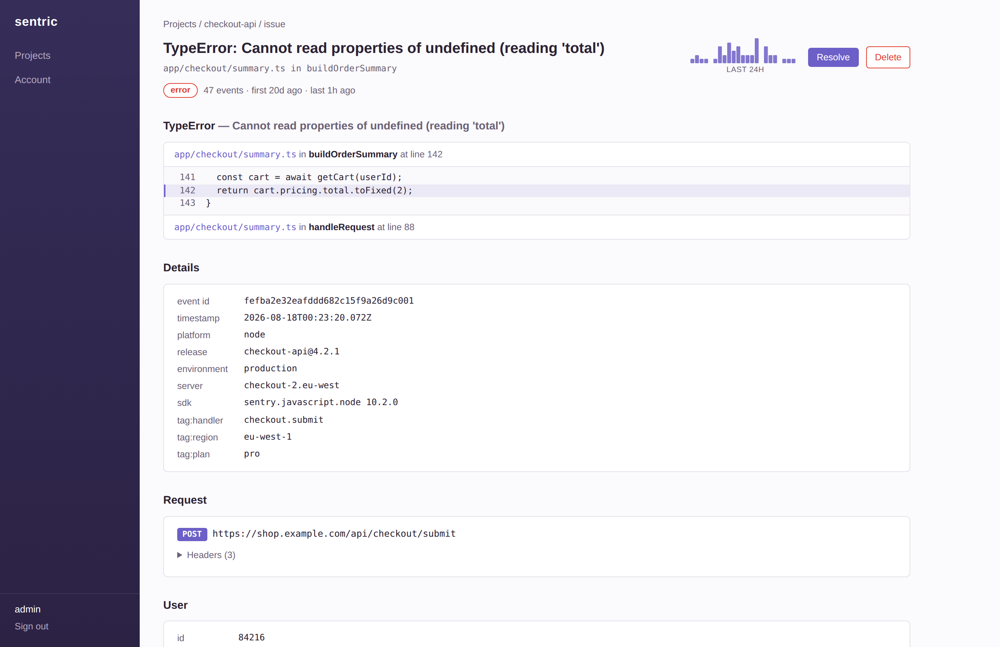
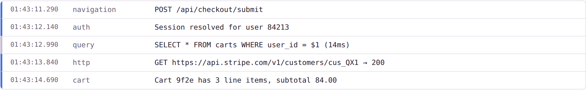

# Sentric

Self-hosted error tracking that speaks Sentry's protocol.

You keep using the official Sentry SDKs — `@sentry/node`, `@sentry/browser`,
`sentry-python`, whatever you already have. You change the DSN. That's it. Errors land
here instead of sentry.io, get grouped into issues, and show up on a dashboard you run.

Two services and a MongoDB. No Kafka, no Redis, no ClickHouse, no twenty-container
compose file.



## Why this exists

Self-hosting real Sentry means running a couple of dozen services. Most teams don't need
distributed tracing, session replay, or profiling — they need to know when production
throws, what the stack trace was, and whether it's still happening. That's the part
Sentric implements, and it implements it against Sentry's actual wire protocol so you're
not locked into a bespoke client library.

What you give up: performance monitoring, replays, source maps, alerting, and cron
monitors. Sessions and transactions are accepted and discarded so SDKs with tracing
switched on don't error — they just don't show up anywhere.

## Quick start

```sh
cp .env.example .env          # set SESSION_SECRET: openssl rand -hex 32
docker compose up --build -d
docker compose exec ingest node dist/cli/create-user.js admin your-password
```

Open http://localhost:3000, log in, create a project. You get a DSN and copy-paste
instructions for your platform:



Paste the snippet into your app, trigger an error, and the page swaps itself out for the
issue list — it polls while it's waiting, so you don't sit there hitting refresh.

## What the dashboard gives you

Issues are grouped by exception type, a normalised message, and the top in-app stack
frames, so `timeout after 3021ms` and `timeout after 5ms` are one issue rather than two
thousand. Each row carries a 24-hour volume sparkline, the event count, and first/last
seen. Filter by release, environment, or tag; search titles and culprits.

Open an issue and you get the stack trace with source context, the full event payload,
and the state the app was in when it broke:



Breadcrumbs are rendered in order, so you can read what happened in the seconds before
the throw:



Resolve an issue and it drops out of the unresolved list. If the same error happens
again afterwards, Sentric reopens it and flags it as a **regression** rather than quietly
leaving it resolved — a resolved issue that comes back is exactly the thing you want to
find out about. Late events that predate the fix don't trigger that.

## Configuration

Everything lives in a single `.env` at the repo root, read by both services.

| Variable | Default | What it does |
| --- | --- | --- |
| `SESSION_SECRET` | — | Signs dashboard session cookies. Required. |
| `INGEST_PUBLIC_URL` | `http://localhost:3001` | Ingest URL **as your apps see it**. Only affects the DSN shown in the UI. |
| `EVENT_RETENTION_DAYS` | `30` | How long raw events are kept. Issue counts are permanent. |
| `COOKIE_SECURE` | `0` | Set to `1` when serving the dashboard over HTTPS. |
| `WEB_PORT` / `INGEST_PORT` | `3000` / `3001` | Host ports. |
| `MONGODB_URI` | `mongodb://mongo:27017/sentric` | Set by compose. |

If you run this anywhere other than localhost, set `INGEST_PUBLIC_URL` to the hostname
your applications will actually reach — that string is what gets baked into every DSN
the UI hands out.

## Behind a reverse proxy

Pass the real `Host` through. nginx's `proxy_pass` sets `Host` to the *upstream*
address by default, and Next.js reads that as the request's host — it then sees a
Server Action posted from `sentric.example.com` claiming to be for `127.0.0.1:10001`,
treats it as CSRF, and aborts every form on the dashboard with
`Invalid Server Actions request`.

```nginx
server {
  listen 80;
  server_name sentric.example.com;

  location / {
    proxy_pass http://127.0.0.1:10001;

    proxy_set_header Host              $host;
    proxy_set_header X-Forwarded-Host  $host;
    proxy_set_header X-Forwarded-Proto $scheme;
    proxy_set_header X-Forwarded-For   $proxy_add_x_forwarded_for;
    proxy_set_header X-Real-IP         $remote_addr;
  }
}

server {
  listen 80;
  server_name ingest.sentric.example.com;

  # ingest caps bodies at 1MB; leave headroom so nginx doesn't 413 first
  client_max_body_size 2m;

  location / {
    proxy_pass http://127.0.0.1:10002;

    proxy_set_header Host              $host;
    proxy_set_header X-Forwarded-Proto $scheme;
    proxy_set_header X-Forwarded-For   $proxy_add_x_forwarded_for;
    proxy_set_header X-Real-IP         $remote_addr;
  }
}
```

Then in `.env`, point `INGEST_PUBLIC_URL` at the public ingest hostname — that string
is baked into every DSN the UI hands out, so leaving it on `localhost` gives your
projects DSNs that only work on the server itself:

```sh
INGEST_PUBLIC_URL=https://ingest.sentric.example.com
COOKIE_SECURE=1          # once TLS terminates at nginx
```

Changing `INGEST_PUBLIC_URL` only affects newly rendered DSNs; the keys themselves
don't change, so apps already reporting keep working once you update their DSN host.

## Users

Sign-up is deliberately CLI-only; there's no public registration and no admin role.

```sh
docker compose exec ingest node dist/cli/create-user.js alice hunter2000
docker compose exec ingest node dist/cli/users.js list
docker compose exec ingest node dist/cli/users.js disable alice
docker compose exec ingest node dist/cli/users.js delete alice
```

Users change their own password from the Account page. Projects are private to their
members — you add people by username from the project header, and any member can add or
remove others. Deleting a user who's the last member of a project is refused, since
there'd be no way back into it.

## The protocol bit

The ingest service implements the endpoints Sentry SDKs actually call:

- `POST /api/<project>/envelope/` — the modern envelope format, parsed byte-accurately
  (item lengths are byte counts, so multibyte payloads don't desync the reader)
- `POST /api/<project>/store/` — the legacy JSON endpoint, handy for `curl`
- Auth via the `X-Sentry-Auth` header, `?sentry_key=`, or the envelope's own `dsn` field
- gzip and deflate request bodies, bounded so a compression bomb can't take the process down
- CORS wide open on `/api/*`, because browser SDKs post from your users' origins, not yours

Project IDs are sequential integers rather than ObjectIds, because `sentry-python` calls
`int()` on the DSN path and would otherwise refuse to start.

Verify an install end to end:

```sh
cd scripts/smoke && npm install
DSN=http://<key>@localhost:3001/1 node send-error.mjs
```

That sends a real exception through `@sentry/node` and then asserts Sentric actually
stored it — an SDK flush succeeding proves nothing about the server, so the script checks
the response id and that a bad key gets rejected.

## Development

```sh
docker compose up -d mongo
(cd ingest && npm install && npm run dev)   # :3001
(cd web && npm install && npm run dev)      # :3000
(cd ingest && npm run create-user -- admin your-password)
```

Both apps read the root `.env` in dev, so the same file drives compose and `npm run dev`.

```sh
cd ingest && npm test
```

Tests cover the envelope parser and the grouping logic — the two places where a subtle
change silently corrupts everything downstream. They're plain `node:test`, no framework.

## Layout

```
ingest/   Hono service: protocol endpoints, grouping, indexes, CLI tools
web/      Next.js dashboard: auth, projects, issues, settings
scripts/  smoke test using the real @sentry/node SDK
```

Both services talk to Mongo directly; they share no code, only the database and the
collection shapes. Each has its own `package.json` and Dockerfile.

## Operational notes

- Raw events expire on a TTL index; issue counts and first/last-seen survive forever, so
  an issue can legitimately show 40k events with none stored.
- Retried deliveries are deduplicated on `(project, event_id)`, so a flaky network
  doesn't inflate counts.
- `lastSeen` is clamped to server time — a client with a wrong clock can't pin its issue
  to the top of your list.
- Mongo runs without authentication and publishes no host port; it's reachable only on
  the compose network. If you expose it, turn auth on.
- The DSN public key is a write-only credential and ships inside browser bundles by
  design. If one leaks, rotate it from the project's Settings page.
